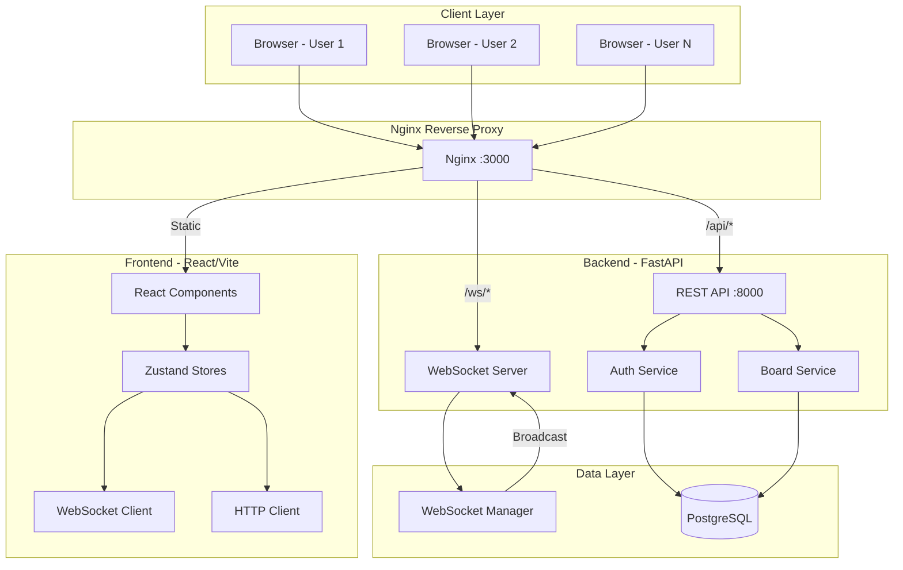
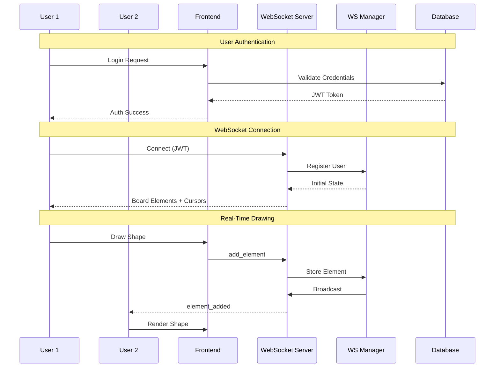
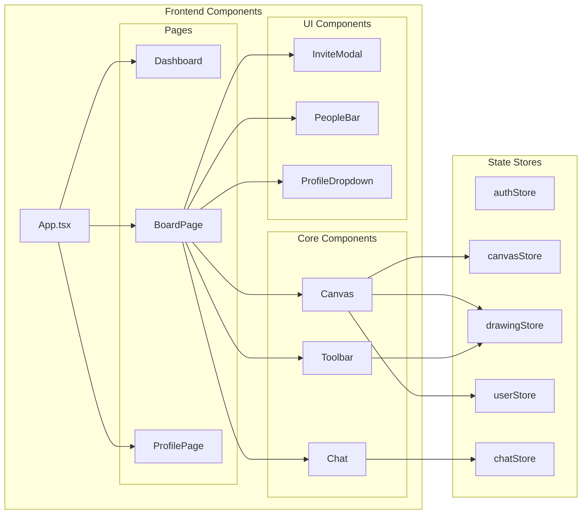
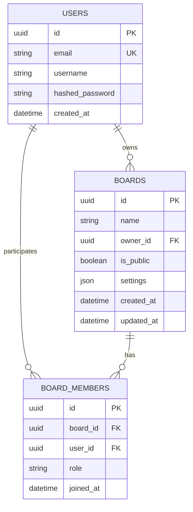

<div align="center">

# 🎨 Realtime Collaborative Whiteboard

### A Modern, Feature-Rich Whiteboard Application for Real-Time Collaboration

[](https://fastapi.tiangolo.com/)
[](https://reactjs.org/)
[](https://www.typescriptlang.org/)
[](https://www.postgresql.org/)
[](https://www.docker.com/)
[](https://developer.mozilla.org/en-US/docs/Web/API/WebSockets_API)

**Create • Collaborate • Design — All in Real-Time**

[Demo](#demo) • [Features](#-features) • [Quick Start](#-quick-start) • [Architecture](#-architecture) • [API Docs](#-api-documentation) • [Contributing](#-contributing)

</div>

---

## 📋 Table of Contents

- [Overview](#-overview)
- [Features](#-features)
- [Demo](#demo)
- [Tech Stack](#-tech-stack)
- [Architecture](#-architecture)
- [Quick Start](#-quick-start)
- [Docker Deployment](#-docker-deployment)
- [Project Structure](#-project-structure)
- [API Documentation](#-api-documentation)
- [WebSocket Events](#-websocket-events)
- [State Management](#-state-management)
- [Configuration](#-configuration)
- [Troubleshooting](#-troubleshooting)
- [Contributing](#-contributing)
- [License](#-license)

---

## 🌟 Overview

A **Miro-inspired** collaborative whiteboard application that enables teams to brainstorm, design, and collaborate in real-time. Built with a modern tech stack featuring **FastAPI** for the backend, **React** with **TypeScript** for the frontend, and **WebSockets** for instant synchronization across all connected users.

### Why This Project?

- 🚀 **Real-Time Collaboration**: See changes instantly as team members draw and edit
- 🎯 **Zero Latency**: WebSocket-based architecture for instant updates
- 📱 **Fully Responsive**: Works seamlessly on desktop, tablet, and mobile devices
- 🐳 **Production Ready**: Containerized with Docker for easy deployment
- 🔐 **Secure**: JWT authentication with role-based access control

---

## ✨ Features

### 🖌️ Drawing Tools
| Tool | Shortcut | Description |
|------|----------|-------------|
| **Pointer** | `V` | Select and move elements |
| **Pencil** | `P` | Freehand drawing with adjustable width |
| **Rectangle** | `R` | Draw rectangles and squares |
| **Circle** | `O` | Draw circles and ellipses |
| **Line** | `L` | Draw straight lines |
| **Arrow** | `A` | Draw directional arrows |
| **Text** | `T` | Add text elements |
| **Sticky Note** | `N` | Add colorful sticky notes |
| **Eraser** | `E` | Remove elements |

### 🎨 Canvas Controls
- **Zoom**: 25% to 400% with smooth transitions
- **Pan**: Middle mouse button or Ctrl+Drag
- **Infinite Canvas**: 8000×8000 pixel workspace
- **Grid Background**: Snap-to-grid alignment support
- **Undo/Redo**: Full history with Ctrl+Z / Ctrl+Shift+Z

### 👥 Collaboration
- **Real-Time Sync**: All drawings synchronized instantly
- **Live Cursors**: See where other users are pointing
- **Presence Awareness**: Know who's online in real-time
- **Board Sharing**: Invite via email or shareable link
- **Live Chat**: Communicate without leaving the board
- **Role-Based Access**: Owner, Editor, Viewer permissions

### 🔐 Security
- JWT token-based authentication
- Password hashing with bcrypt
- CORS protection
- SQL injection prevention
- WebSocket authentication

---

## 🛠️ Tech Stack

### Backend
| Technology | Purpose |
|------------|---------|
| **FastAPI** | High-performance async Python framework |
| **SQLAlchemy** | ORM for database operations |
| **PostgreSQL** | Primary database (SQLite for development) |
| **WebSockets** | Real-time bidirectional communication |
| **Pydantic** | Data validation and serialization |
| **python-jose** | JWT token handling |
| **passlib** | Password hashing |

### Frontend
| Technology | Purpose |
|------------|---------|
| **React 18** | UI component library |
| **TypeScript** | Type-safe JavaScript |
| **Vite** | Fast build tool and dev server |
| **Zustand** | Lightweight state management |
| **Tailwind CSS** | Utility-first CSS framework |
| **React Router** | Client-side routing |
| **React Icons** | Icon library |

### DevOps
| Technology | Purpose |
|------------|---------|
| **Docker** | Containerization |
| **Docker Compose** | Multi-container orchestration |
| **Nginx** | Reverse proxy and static serving |

---

## 🏗️ Architecture

### System Architecture Overview



### Data Flow Architecture



### Component Architecture



### Database Schema



---

## 🚀 Quick Start

### Prerequisites

- **Python** 3.10+
- **Node.js** 18+
- **npm** or **yarn**
- **Docker** (optional, for containerized deployment)

### Local Development Setup

#### 1️⃣ Clone the Repository

```bash
git clone https://github.com/yourusername/realtime-collaborative-whiteboard.git
cd realtime-collaborative-whiteboard
```

#### 2️⃣ Backend Setup

```bash
# Navigate to backend
cd backend

# Create virtual environment
python -m venv venv

# Activate virtual environment
# Windows:
venv\Scripts\activate
# macOS/Linux:
source venv/bin/activate

# Install dependencies
pip install -r requirements.txt

# Start the server
cd ..
python -m uvicorn backend.main:app --reload --port 8000
```

🟢 Backend running at: `http://localhost:8000`  
📚 API Docs: `http://localhost:8000/docs`

#### 3️⃣ Frontend Setup

```bash
# Open new terminal, navigate to frontend
cd frontend

# Install dependencies
npm install

# Start development server
npm run dev
```

🟢 Frontend running at: `http://localhost:5173`

#### 4️⃣ Start Collaborating!

1. Open `http://localhost:5173` in your browser
2. Register a new account
3. Create your first board
4. Share the board link with collaborators
5. Start drawing together in real-time! 🎨

---

## 🐳 Docker Deployment

### One-Command Deployment

```bash
# Build and start all services
docker-compose up --build

# Run in detached mode
docker-compose up -d --build
```

### Services

| Service | Port | Description |
|---------|------|-------------|
| **frontend** | 3000 | React app served via Nginx |
| **backend** | 8000 | FastAPI server |
| **db** | 5432 | PostgreSQL database |

### Access Points

- 🌐 **Application**: http://localhost:3000
- 🔌 **API**: http://localhost:8000
- 📚 **API Docs**: http://localhost:8000/docs

### Docker Commands

```bash
# View logs
docker-compose logs -f

# Stop all services
docker-compose down

# Rebuild specific service
docker-compose up --build frontend

# Clean up volumes
docker-compose down -v
```

---

## 📁 Project Structure

```
realtime-collaborative-whiteboard/
│
├── 📁 backend/                    # FastAPI Backend
│   ├── 📁 api/                    # API Routes
│   │   ├── auth.py               # Authentication endpoints
│   │   ├── boards.py             # Board CRUD operations
│   │   ├── collaboration.py      # Sharing & members
│   │   └── websocket.py          # WebSocket handler
│   │
│   ├── 📁 models/                 # SQLAlchemy Models
│   │   ├── user.py               # User model
│   │   ├── board.py              # Board model
│   │   └── board_member.py       # Membership model
│   │
│   ├── 📁 schemas/                # Pydantic Schemas
│   │   ├── user.py               # User DTOs
│   │   └── board.py              # Board DTOs
│   │
│   ├── 📁 services/               # Business Logic
│   │   └── auth_service.py       # Auth utilities
│   │
│   ├── config.py                 # App configuration
│   ├── database.py               # Database setup
│   ├── websocket_manager.py      # Real-time manager
│   ├── main.py                   # FastAPI app entry
│   ├── requirements.txt          # Python dependencies
│   └── Dockerfile                # Backend container
│
├── 📁 frontend/                   # React Frontend
│   ├── 📁 src/
│   │   ├── 📁 components/         # React Components
│   │   │   ├── 📁 Auth/          # Login, Register
│   │   │   ├── 📁 Canvas/        # Drawing canvas
│   │   │   ├── 📁 Chat/          # Chat panel
│   │   │   ├── 📁 Toolbar/       # Tool selection
│   │   │   ├── InviteModal.tsx   # Sharing modal
│   │   │   ├── PeopleBar.tsx     # Online users
│   │   │   └── ProfileDropdown   # User menu
│   │   │
│   │   ├── 📁 store/              # Zustand Stores
│   │   │   ├── authStore.ts      # Auth state
│   │   │   ├── canvasStore.ts    # Elements state
│   │   │   ├── chatStore.ts      # Chat messages
│   │   │   ├── drawingStore.ts   # Tool settings
│   │   │   └── userStore.ts      # Online users
│   │   │
│   │   ├── 📁 hooks/              # Custom Hooks
│   │   │   └── useWebSocket.ts   # WS connection
│   │   │
│   │   ├── 📁 config/             # Configuration
│   │   │   └── api.ts            # API endpoints
│   │   │
│   │   ├── 📁 pages/              # Page Components
│   │   │   └── ProfilePage.tsx   # Profile view
│   │   │
│   │   ├── App.tsx               # Main component
│   │   ├── main.tsx              # Entry point
│   │   └── index.css             # Global styles
│   │
│   ├── package.json              # Node dependencies
│   ├── nginx.conf                # Nginx configuration
│   └── Dockerfile                # Frontend container
│
├── docker-compose.yml            # Container orchestration
└── README.md                     # This file
```

---

## 📚 API Documentation

### Authentication Endpoints

| Method | Endpoint | Description |
|--------|----------|-------------|
| `POST` | `/api/auth/register` | Register new user |
| `POST` | `/api/auth/login` | Login and get JWT |
| `GET` | `/api/auth/me` | Get current user info |

### Board Endpoints

| Method | Endpoint | Description |
|--------|----------|-------------|
| `GET` | `/api/boards/` | List user's boards |
| `POST` | `/api/boards/` | Create new board |
| `GET` | `/api/boards/{id}` | Get board details |
| `PUT` | `/api/boards/{id}` | Update board |
| `DELETE` | `/api/boards/{id}` | Delete board |

### Collaboration Endpoints

| Method | Endpoint | Description |
|--------|----------|-------------|
| `POST` | `/api/boards/{id}/invite` | Invite user by email |
| `GET` | `/api/boards/{id}/members` | List board members |
| `DELETE` | `/api/boards/{id}/members/{user_id}` | Remove member |

### WebSocket Endpoint

```
WS /ws/{board_id}?token={jwt_token}
```

---

## 🔌 WebSocket Events

### Client → Server

| Event | Payload | Description |
|-------|---------|-------------|
| `cursor_move` | `{x, y}` | Update cursor position |
| `add_element` | `{element}` | Add new element |
| `update_element` | `{element}` | Update existing element |
| `delete_element` | `{elementId}` | Delete element |
| `chat_message` | `{text, userName}` | Send chat message |

### Server → Client

| Event | Payload | Description |
|-------|---------|-------------|
| `initial_state` | `{elements, cursors}` | Board state on connect |
| `user_joined` | `{userId, userName, userColor}` | New user connected |
| `user_left` | `{userId}` | User disconnected |
| `cursor_update` | `{userId, x, y}` | Cursor position update |
| `element_added` | `{element}` | New element from other user |
| `element_updated` | `{element}` | Element update |
| `element_deleted` | `{elementId}` | Element removed |
| `chat_message` | `{userId, userName, text}` | New chat message |

---

## 🗂️ State Management

### Zustand Stores

| Store | Purpose | Key State |
|-------|---------|-----------|
| **authStore** | Authentication | `token`, `userId`, `username` |
| **canvasStore** | Canvas elements | `elements[]`, CRUD methods |
| **drawingStore** | Tool settings | `currentTool`, `color`, `strokeWidth` |
| **userStore** | Online users | `users{}`, cursor positions |
| **chatStore** | Chat messages | `messages[]` |

---

## ⚙️ Configuration

### Environment Variables

Create `.env` file in `backend/`:

```env
# JWT Configuration
SECRET_KEY=your-super-secret-key-change-in-production
JWT_ALGORITHM=HS256

# Database
POSTGRES_HOST=db
POSTGRES_PORT=5432
POSTGRES_DB=whiteboard
POSTGRES_USER=whiteboard
POSTGRES_PASSWORD=whiteboard

# CORS
BACKEND_CORS_ORIGINS=http://localhost:3000,http://localhost:5173
```

### Frontend Environment

Create `.env` in `frontend/` (optional, for Docker):

```env
VITE_API_URL=/api
VITE_WS_URL=ws://localhost:3000/ws
```

---

## 🔧 Troubleshooting

### Common Issues

| Issue | Solution |
|-------|----------|
| **WebSocket not connecting** | Check if backend is running, verify JWT token |
| **CORS errors** | Add frontend URL to `BACKEND_CORS_ORIGINS` |
| **Database connection failed** | Verify PostgreSQL is running, check credentials |
| **Drawing not syncing** | Check browser console for WebSocket errors |
| **Docker build fails** | Run `docker system prune` and retry |

### Logs

```bash
# Backend logs
docker-compose logs backend

# Frontend logs
docker-compose logs frontend

# All logs
docker-compose logs -f
```

---

## 🤝 Contributing

We welcome contributions! Here's how to get started:

1. **Fork** the repository
2. **Create** a feature branch: `git checkout -b feature/amazing-feature`
3. **Commit** changes: `git commit -m 'Add amazing feature'`
4. **Push** to branch: `git push origin feature/amazing-feature`
5. **Open** a Pull Request

### Development Guidelines

- Follow existing code style
- Write meaningful commit messages
- Add tests for new features
- Update documentation as needed

---

## 📄 License

This project is licensed under the **MIT License** - see the [LICENSE](LICENSE) file for details.

---

## 🙏 Acknowledgments

- Inspired by [Miro](https://miro.com/)
- Built with [FastAPI](https://fastapi.tiangolo.com/)
- UI powered by [React](https://reactjs.org/) and [Tailwind CSS](https://tailwindcss.com/)

---

<div align="center">

**Built with ❤️ for Real-Time Collaboration**

⭐ Star this repo if you find it useful!

</div>
